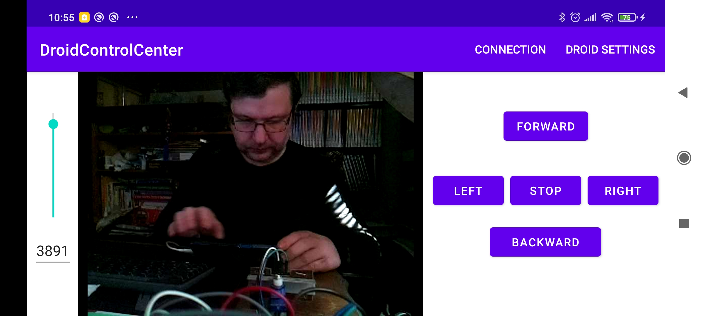
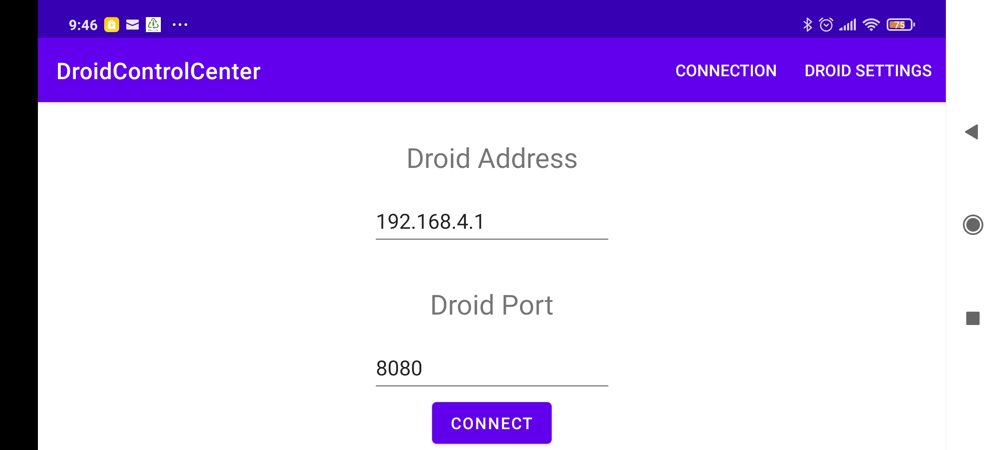

# DroidControlCenter
Droid Control Center for the robotics and rc_vehicles.

It should be used for the robotics/4wd version with Raspberry Pi Zero W
or rc_vehicles (Arduino or Raspberry Pi Pico).

## Usage:

### Move the droid

First you have to connect to the droid and get the settings from it.

If the application is not connected to the droid a popup will appear asking to connect to the droid. 

Change the power settings with desired power off the droid (this imply changing the speed of the droid)

OBS!:

If droid is configured with obstacle avoidance sensors it will stop if an object is less the 
configured distance or if the fix sensors has been triggered.

If the collision is detected the droid will stop regardless of the pressed button in the direction of collision. 

Use the button to move:

The droid is moving as the button is pressed, when the button is released it will coast (no power to the engines).

The stop button will break the engines.

Internal communication:

M1,0# to move forward

M-1,0# to move backward

M0,0# to coast

b# to full stop the droid (break the engines)

M0,1# to rotate right

M0,-1# to rotate left

### First connect to the droid

#### Wifi

The defaults are for ESP01 AP

The Raspberry Pi Zero W has:

ESP-01 with AP

Internal WIFI (address is given by DHCP)

#### Bluetooth (BLE Low Energy)

The Raspberry Pi Zero W has the default BLE.

Arduino and Raspberry Pi Pico has HC-06 attached on serial.

### Get the power settings from the Droid

Those settings could be modified and send back to the droid.

Internal communication:

#### To get information from the droid

V# to get the maximum allowed power

v# to get the minimum allowed power

d# to get the low power distance (only for droid that support that)

s# to get the stopping distance (only for droid that support that)

#### To send information to the droid

After each command the droid response with OK.

Vxxx# to set the maximum allowed power to xxx

vxxx# to set the minimum allowed power to xxx

dxxx# to set the low power distance to xxx (only for droid that support that)

sxxx# to set the stopping distance to xxx (only for droid that support that)

### Get internal WiFi address and stream camera settings

Only for droid that support internal WiFi and Streaming Camera (Raspberry Pi Zero W).

Those settings are used for the internal vlc to display stream camera.

Internal communication:

I# command send to droid and it will reply with:

wifi:address1,address2#StreamCamera:camera_status,camera_protocol,camera_port,camera_codec,camera_framerate#

When the display camera is touched and the camera is enabled (camera_status=on):

First touch starts the camera sending T# command to the droid.

Second touch stop the camera sending t# command to the droid.

The same commands are send when screen is rotated if the camera is streaming.
